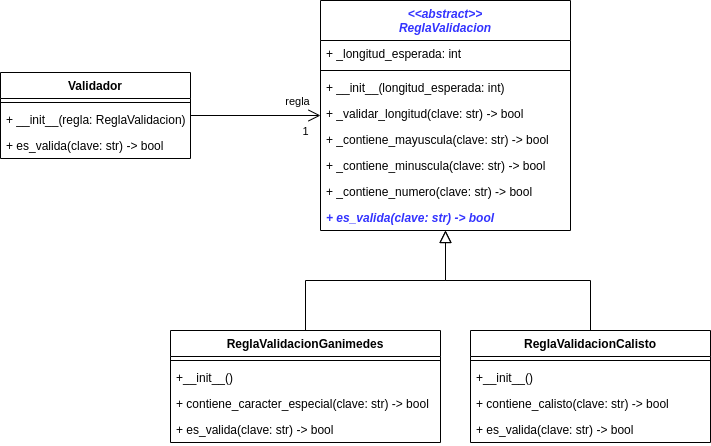

# Ejercicio Validador de Clave

Para este ejercicio vas a suponer que trabajas en un proyecto donde te asignan la tarea 
de desarrollar un módulo para la validación de una clave.

En el diseño del módulo para validación de clave se establecieron dos reglas de validación, 
las cuales fueron nombradas como Validación Ganímedes y Validación Calisto.

### 1. Validación Ganímedes

Esta regla de validación verifica si una clave cumple con lo siguiente:

* Tiene una longitud de más de 8 caracteres
* Tiene al menos una letra mayúscula
* Tiene al menos una letra minúscula
* Tiene al menos un número
* Tiene al menos un caracter especial que puede ser cualquiera de `@`, `_`, `#`, `$` o `%`

### 2. Validación Calisto

Esta regla de validación verifica si una clave cumple con lo siguiente:

* Tiene una longitud de más de 6 caracteres
* Tiene al menos un número
* Tiene la palabra `calisto` escrita con al menos dos letras en mayúscula, pero no todas.
Por ejemplo, `cAliStO` sería válida.

Cada condición de las reglas se verifica una por una y en el orden en el que aparecen en 
la descripción. Esto quiere decir que si una condición no se cumple, no se verifican las siguientes.

Con base en los requisitos del problema, el arquitecto de software del proyecto realizó el siguiente 
diseño para el módulo de validación de claves:

Tu misión es implementar el modelo planteado por el arquitecto de software. Para lograr tu misión 
debes tener en cuenta lo siguiente:

* La clase `ReglaValidacion` es una clase abstracta y su método `es_valida` es igualmente abstracto.
* El método `_validar_longitud` de la clase `ReglaValidacion` implementan la lógica para verificar 
la longitud de la clave. Para implementar dicho método debes tener en cuenta el atributo 
`_longitud_esperada`, el cual es inicializado en el constructor de la clase e indica la longitud que 
la clave debe superar.
* Los métodos `_contiene_mayuscula`, `_contiene_minuscula` y `_contiene_numero` de la clase 
`ReglaValidacion` implementan correspondientemente la lógica que verifica si una clave tiene una 
letra mayúscula, tiene una letra minúscula y tiene un número. Para implementar dichos métodos puedes 
utilizar los métodos de la clase `str` `isupper()`, `islower()` e `isdigit()`.
* La clase `ReglaValidacionGanimedes` tiene un método `contiene_caracter_especial` donde debes 
implementar la lógica para verificar si una clave contiene al menos uno de los caracteres 
especiales `@` `_` `#` `$` `%`.
* La clase `ReglaValidacionCalisto` tiene un método `contiene_calisto` donde debes implementar 
la lógica para verificar si una clave contiene la palabra `calisto` escrita con al menos dos 
letras mayúsculas, pero no con todas las letras mayúsculas.
* Los métodos `es_valida` en las clases `ReglaValidacionGanimedes` y `ReglaValidacionCalisto`
son las implementaciones del método abstracto de la clase padre. En estos métodos debes implementar 
las reglas correspondientes a cada tipo de validación, utilizando los demás métodos donde están 
definidas cada una de las reglas. 
* Los métodos `es_valida` en las clases `ReglaValidacionGanimedes` y `ReglaValidacionCalisto` deben 
arrojar excepciones para los casos en que no se cumplan las reglas. En el proyecto hay una jerarquía 
de tipos de excepciones (en el módulo `errores.py`), correspondientes a cada regla, que debes utilizar 
para generar las excepciones. Las reglas se deben verificar en el orden en el que se especifican en la 
descripción. En el caso en el que se cumplan todas las reglas, el método debe retornar `True`.
* El método `es_valida` de la clase `Validador` debe retornar el resultado de invocar el método 
`es_valida` en el objeto `regla` que tiene como atributo.

Para realizar la actividad puedes clonar este repositorio e implementar el código en el archivo 
`validador.py` que se encuentra en el paquete `validadorclave.modelo`.

Una vez clones el repositorio, debes crear y activar el ambiente virtual. Si sabes como hacerlo en PyCharm o VSCode, hazlo. Si no, ejecuta los siguientes comandos en la consola de Windows:

* `python -m venv venv`
* `venv/Scripts/activate`
* `pip install -r requirements.txt`

Si te sale un mensaje de error diciendo que no tienes permisos para ejecutar scripts, ejecuta el siguiente comando:

* `Set-ExecutionPolicy -ExecutionPolicy RemoteSigned -Scope CurrentUser`

## Tenga en cuenta

* El proyecto incluye un conjunto de pruebas que puedes utilizar para verificar el cumplimiento de los 
requisitos establecidos. Para ejecutar las pruebas, debes instalar la dependencia pytest.
* Para que las pruebas funcionen adecuadamente debes implementar el código respetando los nombres y la 
definición de las clases y los métodos que se presentan en el diagrama.
* La evaluación del ejercicio se hará con base en el cumplimiento de los requisitos que arrojen las 
pruebas. Por lo tanto, cualquier fallo en las pruebas debido a nombres mal escritos o que no concuerden
con el modelo dado se considerará como un requisito no cumplido, afectando la calificación del examen.
